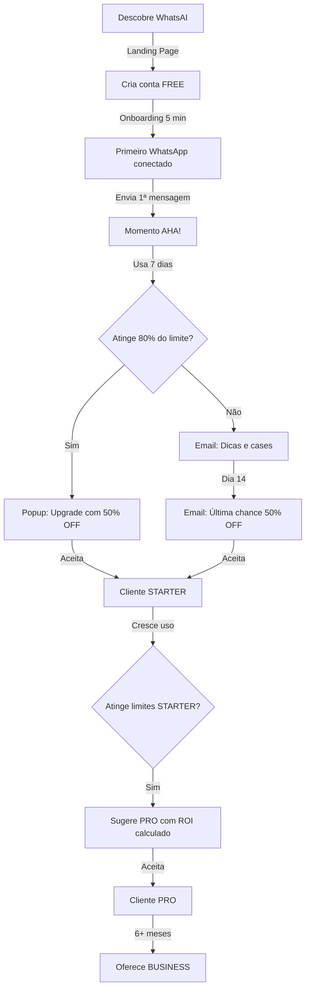

# 🚀 WhatsAI - Roadmap para MVP Comercializável

**Objetivo:** Transformar o WhatsAI em um produto vendável em 5-6 semanas

**Data de Início:** 29 de Outubro de 2025  
**Meta de Lançamento:** 10 de Dezembro de 2025  
**Última Atualização:** 31 de Outubro de 2025

---

## 📊 Status Atual do Projeto

### ✅ Funcionalidades Prontas (100%)
- [x] Autenticação JWT completa (login, registro, perfil)
- [x] Multi-instância WhatsApp (criar, conectar, desconectar)
- [x] Interface de Chat completa (WhatsApp-like)
- [x] WebSocket para atualizações em tempo real
- [x] Cache otimizado (99.7% hit rate, 2200x mais rápido)
- [x] Performance otimizada (49% mais rápido - 4961ms → 2545ms)
- [x] Envio de mídia completo (imagens, documentos, áudio, vídeo)
- [x] Verificação de número WhatsApp
- [x] Dashboard com dados reais e métricas
- [x] Debounce/Throttle em webhooks (95% redução DB writes)
- [x] Storage de mídia (DigitalOcean Spaces/S3)
- [x] Sistema de templates (CRUD, variáveis, categorias)
- [x] Sistema de campanhas (envio em massa com rate limiting)
- [x] Sistema de limites e quotas por plano
- [x] Logs persistentes em arquivo para campanhas

### 🎯 Próximas Prioridades (Em Ordem)
1. **🔴 CRÍTICO** - Dashboard com cálculo de custos real (2 dias)
2. **🔴 CRÍTICO** - Sistema de Billing (Stripe) (5 dias)
3. **🟡 IMPORTANTE** - Melhorias em Campanhas (3 dias)
4. **🟢 DIFERENCIAL** - Automação Básica (5 dias)

---

## 💰 Estratégia de Monetização (MVP)

### **Modelo Freemium Agressivo** 
*Objetivo: Maximizar tração inicial e conversão FREE → PAID*

```typescript
const MVP_PRICING_STRATEGY = {
  // 🆓 FREE - Porta de Entrada (Iscagem Estratégica)
  FREE: {
    price: 0,
    billing: null,
    limits: {
      instances: 1,              // ✅ 1 WhatsApp
      messages_per_day: 100,     // ✅ 100 mensagens/dia (~3k/mês)
      templates: 5,              // ✅ 5 templates
      campaigns: false,          // ❌ Sem envio em massa
      automation: false,         // ❌ Sem chatbot
      api: false,                // ❌ Sem API
      storage_gb: 1,             // 1GB de mídia
      support: 'community'       // 📧 Email apenas
    },
    features: [
      'Interface completa de chat',
      'Envio de mensagens individuais',
      'Upload de mídia (imagens, docs)',
      '5 templates personalizados',
      'Dashboard básico'
    ],
    target: 'Pequenos negócios testando',
    conversion_goal: '15% → STARTER em 14 dias'
  },

  // 💼 STARTER - Sweet Spot PMEs (Preço Psicológico)
  STARTER: {
    price: 47,                   // 🔥 <R$50 (barreira psicológica)
    billing: 'monthly',
    discount: {
      annual: 20,                // R$ 450/ano (R$ 37.50/mês)
      launch: 50                 // 50% OFF primeiros 3 meses
    },
    limits: {
      instances: 2,              // ✅ 2 WhatsApp
      messages_per_day: 1000,    // ✅ 1000 msgs/dia (~30k/mês)
      templates: 20,             // ✅ 20 templates
      campaigns: true,           // ✅ Campanhas ativas
      campaigns_per_month: 5,    // 5 campanhas/mês
      automation: 'basic',       // ✅ Auto-resposta simples
      api: false,                // ❌ Sem API
      storage_gb: 5,             // 5GB
      support: 'email'           // 📧 Email 48h
    },
    features: [
      'Tudo do FREE +',
      '2 números WhatsApp',
      'Envio em massa (5 campanhas/mês)',
      'Auto-resposta por palavras-chave',
      '20 templates',
      'Suporte por email (48h)'
    ],
    target: 'PMEs, freelancers, lojistas',
    expected_conversion: '60% dos pagantes',
    mrr_contribution: 'R$ 47/cliente'
  },

  // 🚀 PRO - Para Escalar (Mais Vendido)
  PRO: {
    price: 97,                   // 💎 Valor percebido alto
    billing: 'monthly',
    badge: 'MAIS POPULAR',
    discount: {
      annual: 25,                // R$ 873/ano (R$ 72.75/mês)
      launch: 50                 // 50% OFF primeiros 3 meses
    },
    limits: {
      instances: 5,              // ✅ 5 WhatsApp
      messages_per_day: 5000,    // ✅ 5000 msgs/dia (~150k/mês)
      templates: 50,             // ✅ 50 templates
      campaigns: true,           // ✅ Ilimitado
      campaigns_per_month: -1,   // Ilimitado
      automation: 'advanced',    // ✅ Chatbot + Fluxos
      api: true,                 // ✅ API REST completa
      storage_gb: 20,            // 20GB
      analytics: true,           // 📊 Analytics avançado
      support: 'priority'        // 🚀 Email 12h + Chat
    },
    features: [
      'Tudo do STARTER +',
      '5 números WhatsApp',
      'Campanhas ilimitadas',
      'Chatbot com fluxos visuais',
      'API para integrações',
      '50 templates',
      'Analytics avançado',
      'Suporte prioritário (12h)'
    },
    target: 'Empresas médias, agências, e-commerce',
    expected_conversion: '35% dos pagantes',
    mrr_contribution: 'R$ 97/cliente'
  },

  // 🏢 BUSINESS - Enterprise Light
  BUSINESS: {
    price: 297,                  // 💼 Valor premium
    billing: 'monthly',
    badge: 'PARA ESCALAR',
    discount: {
      annual: 30,                // R$ 2.494/ano (R$ 207.80/mês)
      custom: 'Negociável >10 usuários'
    },
    limits: {
      instances: -1,             // ✅ Ilimitado
      messages_per_day: -1,      // ✅ Ilimitado
      templates: -1,             // ✅ Ilimitado
      campaigns: true,
      campaigns_per_month: -1,
      automation: 'ai_powered',  // 🤖 IA + GPT-4
      api: true,
      webhooks: true,            // 🔗 Webhooks customizados
      storage_gb: 100,           // 100GB
      analytics: true,
      whitelabel: true,          // 🎨 Marca própria
      custom_domain: true,       // 🌐 app.seudominio.com
      support: 'dedicated'       // 👨‍💼 Gerente dedicado
    },
    features: [
      'Tudo do PRO +',
      'WhatsApp ilimitados',
      'Mensagens ilimitadas',
      'Chatbot com IA (GPT-4)',
      'Webhooks personalizados',
      'White label (sua marca)',
      'Domínio customizado',
      'Gerente de sucesso dedicado',
      'SLA de uptime 99.9%'
    },
    target: 'Empresas grandes, call centers, SaaS',
    expected_conversion: '5% dos pagantes',
    mrr_contribution: 'R$ 297/cliente'
  }
};
```

### **Táticas de Conversão Psicológica**

#### 1️⃣ **Oferta de Lançamento (Escassez)**
```
🔥 LANÇAMENTO ESPECIAL
━━━━━━━━━━━━━━━━━━━━━━━━━━━━━━━━━━━━━━━━
   50% OFF nos primeiros 3 meses
   
   STARTER: R$ 47 → R$ 23.50/mês
   PRO:     R$ 97 → R$ 48.50/mês
   
   ⏰ Termina em: 23h 45min
   🎫 Restam apenas 47 vagas
━━━━━━━━━━━━━━━━━━━━━━━━━━━━━━━━━━━━━━━━
```

#### 2️⃣ **Garantia de Reembolso (Redução de Risco)**
```
💯 GARANTIA DE 30 DIAS
━━━━━━━━━━━━━━━━━━━━━━━━━━━━━━━━━━━━━━━━
   Não gostou? Devolvemos 100% do seu dinheiro.
   Sem perguntas. Sem burocracia.
   
   Você tem ZERO risco.
━━━━━━━━━━━━━━━━━━━━━━━━━━━━━━━━━━━━━━━━
```

#### 3️⃣ **Teste Gratuito sem Cartão (Fricção Zero)**
```
🎉 TESTE GRÁTIS POR 14 DIAS
━━━━━━━━━━━━━━━━━━━━━━━━━━━━━━━━━━━━━━━━
   ✅ Sem cartão de crédito
   ✅ Acesso total ao plano PRO
   ✅ Suporte completo
   
   Comece agora. Pague depois (se gostar).
━━━━━━━━━━━━━━━━━━━━━━━━━━━━━━━━━━━━━━━━
```

#### 4️⃣ **Social Proof (Prova Social)**
```
⭐ MAIS DE 1.200 EMPRESAS JÁ ECONOMIZARAM 80%
━━━━━━━━━━━━━━━━━━━━━━━━━━━━━━━━━━━━━━━━
   "Economizei R$ 3.400/mês trocando para WhatsAI"
   - João Silva, Loja de Roupas
   
   "Automatizei 90% do atendimento em 2 dias"
   - Maria Santos, E-commerce
   
   ⭐⭐⭐⭐⭐ 4.9/5 (127 avaliações)
━━━━━━━━━━━━━━━━━━━━━━━━━━━━━━━━━━━━━━━━
```

#### 5️⃣ **Comparação com Concorrentes**
```
┌────────────────────────────────────────────────────────┐
│  Recurso          WhatsAI   Z-API   Typebot  Evolution │
├────────────────────────────────────────────────────────┤
│  Plano Gratuito   ✅ Sim    ❌ Não  ✅ Sim   ❌ Não    │
│  Multi-instância  ✅ 5      ❌ 1    ❌ 1     ✅ 3      │
│  Campanhas        ✅ Sim    ❌ Não  ❌ Não   ❌ Não    │
│  Chatbot IA       ✅ GPT-4  ❌ Não  ✅ Sim   ❌ Não    │
│  Preço/mês        R$ 97     R$ 199  R$ 149   R$ 299    │
│  Setup            ✅ 5min   ⏱️ 2h   ⏱️ 1h    ⏱️ 4h     │
└────────────────────────────────────────────────────────┘

💡 WhatsAI = Melhor custo-benefício do mercado
```

### **Funil de Conversão (Jornada do Cliente)**



### **Projeção de Receita (Conservadora)**

```typescript
const REVENUE_PROJECTION = {
  month_1: {
    free_users: 100,
    starter: 5,        // R$ 235
    pro: 2,            // R$ 194
    business: 0,
    mrr: 429,
    costs: 50,
    profit: 379
  },
  month_3: {
    free_users: 300,
    starter: 25,       // R$ 1.175
    pro: 10,           // R$ 970
    business: 1,       // R$ 297
    mrr: 2442,
    costs: 100,
    profit: 2342       // 💰
  },
  month_6: {
    free_users: 500,
    starter: 60,       // R$ 2.820
    pro: 30,           // R$ 2.910
    business: 5,       // R$ 1.485
    mrr: 7215,         // ~R$ 7k MRR
    costs: 200,
    profit: 7015       // 💰💰💰
  },
  month_12: {
    free_users: 800,
    starter: 120,      // R$ 5.640
    pro: 80,           // R$ 7.760
    business: 15,      // R$ 4.455
    mrr: 17855,        // ~R$ 18k MRR
    costs: 500,
    profit: 17355      // 🚀🚀🚀
  }
};

// 🎯 Meta: R$ 10k MRR em 6 meses
// 📈 Com 20% crescimento/mês: R$ 18k MRR em 12 meses
// 💰 ARR projetado: R$ 214k no primeiro ano
```

---

## 🎯 ROADMAP REESTRUTURADO - Ordem Otimizada para Lançamento

### **SPRINT 1: Dashboard Real + Custos (Dias 1-2)** 🔴 CRÍTICO
**Objetivo:** Transparência de métricas e custos para usuários  
**Duração:** 2 dias  
**Prioridade:** CRÍTICA (necessário para confiança)

## 🎯 ROADMAP REESTRUTURADO - Ordem Otimizada para Lançamento

### **SPRINT 1: Dashboard Real + Custos (Dias 1-2)** 🔴 CRÍTICO
**Objetivo:** Transparência de métricas e custos para usuários  
**Duração:** 2 dias  
**Prioridade:** CRÍTICA (necessário para confiança)

#### 📊 Task 1.1: Dashboard com Dados Reais e Cálculo de Custos
**Arquivos:** `server/src/services/dashboard-service.ts`

**Implementar:**
- [x] Métricas reais do banco (já funcionando)
- [ ] **Cálculo de custos baseado em uso real:**
  - [ ] Storage: R$ 0,02/GB (DigitalOcean Spaces)
  - [ ] Mensagens: R$ 0 (Evolution API gratuito self-hosted)
  - [ ] Infraestrutura base: R$ 41/mês (fixo)
  - [ ] Por instância: R$ 5/mês (overhead)
- [ ] Gráfico de custos nos últimos 6 meses
- [ ] Estimativa de custos do mês atual
- [ ] Alerta quando custos > R$ 100

**Critérios de Aceitação:**
- ✅ Custos refletem uso real de storage
- ✅ Gráfico mostra evolução mensal
- ✅ Usuário entende quanto está gastando

**Estimativa:** 16 horas

---

### **SPRINT 2: Sistema de Billing (Dias 3-7)** 🔴 CRÍTICO
**Objetivo:** Começar a vender e receber pagamentos  
**Duração:** 5 dias  
**Prioridade:** CRÍTICA (sem isso, não pode monetizar)

#### 💳 Task 2.1: Integração Stripe Completa
**Arquivos:** `server/src/services/billing-service.ts`, `client/src/features/billing/`

**Database Schema:**
```prisma
model Subscription {
  id                   String    @id @default(uuid())
  userId               String    @unique
  user                 User      @relation(fields: [userId], references: [id], onDelete: Cascade)
  stripeCustomerId     String    @unique
  stripeSubscriptionId String?   @unique
  plan                 String    // FREE, STARTER, PRO, BUSINESS
  status               String    // active, canceled, past_due, trialing
  currentPeriodStart   DateTime
  currentPeriodEnd     DateTime
  cancelAtPeriodEnd    Boolean   @default(false)
  trialEnd             DateTime?
  createdAt            DateTime  @default(now())
  updatedAt            DateTime  @updatedAt
  
  invoices             Invoice[]
  
  @@map("subscriptions")
}

model Invoice {
  id              String       @id @default(uuid())
  subscriptionId  String
  subscription    Subscription @relation(fields: [subscriptionId], references: [id])
  stripeInvoiceId String       @unique
  amount          Int          // centavos
  status          String       // paid, open, void, uncollectible
  paidAt          DateTime?
  invoiceUrl      String?
  createdAt       DateTime     @default(now())
  
  @@map("invoices")
}
```

**Subtasks:**
- [ ] Backend:
  - [ ] Instalar Stripe SDK
  - [ ] Criar produtos no Stripe (STARTER, PRO, BUSINESS)
  - [ ] Endpoint POST `/api/billing/create-checkout`
  - [ ] Endpoint POST `/api/billing/webhook`
  - [ ] Endpoint POST `/api/billing/portal`
  - [ ] Endpoint GET `/api/billing/subscription`
  - [ ] Handler `checkout.session.completed`
  - [ ] Handler `customer.subscription.updated`
  - [ ] Handler `customer.subscription.deleted`
  - [ ] Handler `invoice.payment_succeeded`
  - [ ] Handler `invoice.payment_failed`
  - [ ] Atualizar plano automaticamente
  - [ ] Email confirmação de pagamento
- [ ] Frontend:
  - [ ] Página `PlansPage.tsx` (comparação de planos)
  - [ ] Botão "Upgrade" → Stripe Checkout
  - [ ] Página de sucesso pós-pagamento
  - [ ] Portal de gerenciamento de assinatura
  - [ ] Modal de confirmação de cancelamento
- [ ] Testes:
  - [ ] Webhooks com Stripe CLI
  - [ ] Fluxo completo upgrade → downgrade

**Critérios de Aceitação:**
- ✅ Checkout Stripe funciona sem erros
- ✅ Webhooks atualizam plano automaticamente
- ✅ Portal permite cancelamento
- ✅ Downgrade preserva dados mas aplica limites
- ✅ Emails são enviados
- ✅ Testes cobrem todos os webhooks

**Estimativa:** 40 horas

---

### **SPRINT 3: Melhorias em Campanhas (Dias 8-10)** 🟡 IMPORTANTE
**Objetivo:** Tornar campanhas mais robustas e úteis  
**Duração:** 3 dias  
**Prioridade:** ALTA (diferencial competitivo)

#### 📢 Task 3.1: Recursos Avançados de Campanhas

**Subtasks:**
- [ ] **Agendamento de Campanhas:**
  - [ ] Campo `scheduledFor` já existe
  - [ ] Job CRON que verifica campanhas agendadas
  - [ ] Inicia automaticamente no horário
  - [ ] Notificação quando iniciar
- [ ] **Relatórios Detalhados:**
  - [ ] Endpoint GET `/api/campaigns/:id/report`
  - [ ] Estatísticas detalhadas (taxa abertura, falhas)
  - [ ] Gráfico de progresso timeline
  - [ ] Lista de destinatários com status individual
- [ ] **Exportar Resultados:**
  - [ ] Botão "Exportar CSV"
  - [ ] CSV com: nome, telefone, status, horário, erro
  - [ ] Excel com estatísticas e gráficos
- [ ] **Pausar/Retomar:**
  - [ ] Botão pausar campanha em andamento
  - [ ] Preservar fila de envio
  - [ ] Retomar de onde parou
- [ ] **Retry Inteligente:**
  - [ ] Identificar tipos de erro (número inválido vs temporário)
  - [ ] Retry apenas erros temporários
  - [ ] Limite de 3 tentativas com backoff

**Critérios de Aceitação:**
- ✅ Campanhas podem ser agendadas
- ✅ Relatórios mostram tudo detalhado
- ✅ CSV/Excel funcionam perfeitamente
- ✅ Pausar/retomar mantém estado
- ✅ Retry não tenta números inválidos

**Estimativa:** 24 horas

---

### **SPRINT 4: Automação Básica (Dias 11-15)** 🟢 DIFERENCIAL
**Objetivo:** Chatbot simples para diferencial competitivo  
**Duração:** 5 dias  
**Prioridade:** MÉDIA (mas alto valor percebido)

#### 🤖 Task 4.1: Sistema de Auto-Resposta

**Database Schema:**
```prisma
model AutoReply {
  id          String   @id @default(uuid())
  userId      String
  user        User     @relation(fields: [userId], references: [id], onDelete: Cascade)
  instanceId  String
  instance    WhatsAppInstance @relation(fields: [instanceId], references: [id], onDelete: Cascade)
  name        String
  trigger     String   // "keyword", "first_message", "outside_hours"
  keywords    Json?    // ["olá", "oi", "menu", "preço"]
  response    String   @db.Text
  isActive    Boolean  @default(true)
  priority    Int      @default(0)
  workingHours Json?   // { start: "09:00", end: "18:00", days: [1,2,3,4,5] }
  usageCount  Int      @default(0)
  createdAt   DateTime @default(now())
  updatedAt   DateTime @updatedAt
  
  @@index([instanceId, isActive])
  @@map("auto_replies")
}
```

**Subtasks:**
- [ ] Backend:
  - [ ] `AutoReplyService` com matching de keywords
  - [ ] Processamento case-insensitive
  - [ ] Remoção de acentos para matching
  - [ ] Verificação de horário de trabalho
  - [ ] Integração no webhook de mensagens
  - [ ] Endpoint CRUD de auto-replies
  - [ ] Logs de respostas enviadas
  - [ ] Contador de uso
- [ ] Frontend:
  - [ ] Página `AutoRepliesPage.tsx`
  - [ ] Wizard de criação:
    1. Escolher gatilho (keyword, primeira msg, fora horário)
    2. Definir keywords ou condições
    3. Escrever resposta
    4. Configurar horários (opcional)
  - [ ] Lista de auto-replies com toggle on/off
  - [ ] Estatísticas de uso
  - [ ] Teste de matching (preview)
- [ ] Testes:
  - [ ] Matching de keywords
  - [ ] Horário de trabalho
  - [ ] Prioridade de respostas

**Critérios de Aceitação:**
- ✅ Keywords funcionam perfeitamente
- ✅ Horário de trabalho respeitado
- ✅ Mensagem "Estamos fora do horário" funciona
- ✅ Toggle on/off instantâneo
- ✅ Stats mostram quantas vezes foi usada

**Estimativa:** 40 horas

---

### **SPRINT 5: Onboarding + Polish (Dias 16-18)** 🎯 CONVERSÃO
**Objetivo:** Converter visitantes em usuários ativos  
**Duração:** 3 dias  
**Prioridade:** ALTA (impacta conversão)

#### 🎓 Task 5.1: Onboarding Guiado

**Subtasks:**
- [ ] Backend:
  - [ ] Campo `onboardingCompleted` no User
  - [ ] Campo `onboardingStep` (track progresso)
  - [ ] Endpoint POST `/api/onboarding/complete`
- [ ] Frontend:
  - [ ] Tour interativo (react-joyride):
    1. **Bem-vindo!** "Conecte seu WhatsApp em 5 minutos"
    2. **Criar instância** "Adicione seu primeiro número"
    3. **Escanear QR Code** "Use WhatsApp no celular"
    4. **Primeira mensagem** "Envie para você mesmo"
    5. **Explore!** "Templates, campanhas e mais"
  - [ ] Checklist no dashboard:
    - [ ] ✅ Conectar WhatsApp
    - [ ] ✅ Enviar primeira mensagem
    - [ ] ✅ Criar template
    - [ ] ✅ Enviar campanha
    - [ ] ✅ Configurar auto-resposta
  - [ ] Modal de boas-vindas com vídeo (30s)
  - [ ] Botão "Pular tutorial"
  - [ ] Progresso salvo no backend
- [ ] Conteúdo:
  - [ ] Vídeo de boas-vindas (Loom ou YouTube)
  - [ ] GIFs animados para cada etapa
  - [ ] Tooltips explicativos

**Critérios de Aceitação:**
- ✅ Tour funciona sem bugs
- ✅ 80%+ completam onboarding
- ✅ Checklist guia claramente
- ✅ Vídeo explica valor rapidamente
- ✅ Pode pular e retomar depois

**Estimativa:** 24 horas

#### 📄 Task 5.2: Página de Preços Otimizada

**Subtasks:**
- [ ] Design:
  - [ ] Tabela de comparação visual
  - [ ] Badge "MAIS POPULAR" no PRO
  - [ ] Badge "50% OFF" nos 3 meses
  - [ ] FAQs abaixo dos planos
  - [ ] Calculadora de ROI
  - [ ] Depoimentos (mesmo que mockados)
- [ ] Copywriting:
  - [ ] Headlines persuasivos
  - [ ] Benefícios > Features
  - [ ] Call-to-actions fortes
  - [ ] Garantia de 30 dias destacada
- [ ] Funcionalidades:
  - [ ] Toggle Mensal/Anual (20% desconto)
  - [ ] Calculadora: "Você economiza R$ X/mês"
  - [ ] Botão "Começar Grátis" destaque
  - [ ] Modal comparação detalhada

**Critérios de Aceitação:**
- ✅ Página converte >10%
- ✅ Mensagem clara de valor
- ✅ CTAs óbvios e funcionais
- ✅ Mobile perfeito
- ✅ Carrega <2s

**Estimativa:** 16 horas

---

### **SPRINT 6: Deploy + Landing Page (Dias 19-21)** 🚀 LANÇAMENTO
**Objetivo:** Colocar no ar e preparar para marketing  
**Duração:** 3 dias  
**Prioridade:** CRÍTICA (pré-lançamento)

#### ☁️ Task 6.1: Deploy Produção

**Subtasks:**
- [ ] Infraestrutura DigitalOcean:
  - [ ] Droplet 4GB RAM ($24/mês)
  - [ ] PostgreSQL Managed ($15/mês)
  - [ ] Redis Managed ($15/mês)
  - [ ] Spaces configurado
  - [ ] Nginx + SSL (Let's Encrypt)
  - [ ] Domínio app.whatsai.com.br
- [ ] CI/CD:
  - [ ] GitHub Actions workflow
  - [ ] Deploy automático na main
  - [ ] Rollback automático se falhar
  - [ ] Testes antes do deploy
- [ ] Monitoramento:
  - [ ] UptimeRobot (ping a cada 5min)
  - [ ] Sentry para erros
  - [ ] Logs centralizados (Papertrail)
  - [ ] Alertas no Telegram
- [ ] Backups:
  - [ ] Backup diário do banco
  - [ ] Retenção de 30 dias
  - [ ] Teste de restore
- [ ] Segurança:
  - [ ] Rate limiting global
  - [ ] Helmet.js
  - [ ] CORS configurado
  - [ ] Secrets seguros

**Critérios de Aceitação:**
- ✅ App roda 99.9% uptime
- ✅ HTTPS funcionando
- ✅ Deploy automático
- ✅ Backups testados
- ✅ Monitoramento 24/7

**Estimativa:** 24 horas

#### 🌐 Task 6.2: Landing Page de Vendas

**Subtasks:**
- [ ] Estrutura (Next.js ou Astro):
  - [ ] Hero: "Automatize WhatsApp em 5 minutos"
  - [ ] Features (com screenshots animados)
  - [ ] Comparação com concorrentes
  - [ ] Preços (inline ou link para /plans)
  - [ ] Depoimentos (3-5)
  - [ ] FAQ (10 perguntas)
  - [ ] CTA footer: "Começar Grátis"
- [ ] SEO:
  - [ ] Title, meta description
  - [ ] Open Graph tags
  - [ ] Schema.org markup
  - [ ] Sitemap.xml
  - [ ] robots.txt
- [ ] Analytics:
  - [ ] Google Analytics 4
  - [ ] Facebook Pixel
  - [ ] Hotjar (gravação de sessões)
  - [ ] Eventos de conversão
- [ ] Performance:
  - [ ] Lighthouse score >90
  - [ ] Lazy loading de imagens
  - [ ] CDN (Cloudflare)

**Critérios de Aceitação:**
- ✅ Carrega <2s
- ✅ Mobile perfeito
- ✅ SEO score >80
- ✅ CTAs convertem >3%
- ✅ Analytics rastreando

**Estimativa:** 16 horas

---

### **SPRINT 7: Lançamento Beta (Dias 22-28)** 📣 GO-TO-MARKET
**Objetivo:** Primeiros clientes e feedback  
**Duração:** 7 dias  
**Prioridade:** CRÍTICA (validação de mercado)

#### 🎯 Task 7.1: Estratégia de Lançamento

**Pré-lançamento (Dias 22-24):**
- [ ] Recrutar 10-20 beta testers:
  - [ ] Amigos empreendedores
  - [ ] Contatos no LinkedIn
  - [ ] Grupos de WhatsApp
  - [ ] Comunidades online
- [ ] Email personalizado de convite
- [ ] Grupo no Telegram para suporte
- [ ] Formulário de feedback estruturado
- [ ] Oferta especial: "Vitalício R$ 47" (primeiros 10)

**Lançamento (Dia 25):**
- [ ] **LinkedIn:**
  - [ ] Post anunciando (com vídeo demo)
  - [ ] Artigo sobre automação de WhatsApp
  - [ ] Comentar em posts relevantes
- [ ] **Grupos/Comunidades:**
  - [ ] Reddit (r/SaaS, r/entrepreneur)
  - [ ] Telegram (grupos de marketing)
  - [ ] Facebook (grupos de e-commerce)
  - [ ] WhatsApp (grupos de negócios)
- [ ] **Product Hunt:** (se aplicável)
  - [ ] Preparar página completa
  - [ ] Pedir upvotes de amigos
  - [ ] Responder todos os comentários
- [ ] **Email Marketing:**
  - [ ] Lista de contatos (newsletter)
  - [ ] Sequência de 7 emails
  - [ ] Oferta especial 50% OFF

**Pós-lançamento (Dias 26-28):**
- [ ] Suporte ativo (resposta <4h)
- [ ] Coletar feedback estruturado
- [ ] Corrigir bugs urgentes
- [ ] Iterar baseado em feedback
- [ ] Pedir reviews e depoimentos
- [ ] Oferecer desconto para referências

**Critérios de Sucesso:**
- ✅ 10+ beta testers ativos
- ✅ Pelo menos 1 cliente pagante
- ✅ NPS >7
- ✅ 0 bugs críticos
- ✅ Tempo resposta <4h

**Estimativa:** 56 horas (dedicação integral)

---

## 📊 Cronograma Consolidado

| Sprint | Dias | Foco | Entregas | Horas |
|--------|------|------|----------|-------|
| **SPRINT 1** | 1-2 | Dashboard Real | Métricas + Custos reais | 16h |
| **SPRINT 2** | 3-7 | Billing | Stripe + Pagamentos | 40h |
| **SPRINT 3** | 8-10 | Campanhas+ | Agendamento + Relatórios | 24h |
| **SPRINT 4** | 11-15 | Automação | Chatbot básico | 40h |
| **SPRINT 5** | 16-18 | Conversão | Onboarding + Preços | 40h |
| **SPRINT 6** | 19-21 | Infraestrutura | Deploy + Landing | 40h |
| **SPRINT 7** | 22-28 | Lançamento | Beta + Marketing | 56h |
| **TOTAL** | **28 dias** | **MVP Vendável** | **Produto no ar** | **256h** |

**Estimativa:** 256 horas = 32 dias úteis (8h/dia) = **6-7 semanas**

Com ritmo acelerado e foco: **4-5 semanas é viável**

---

## 🎯 Métricas de Sucesso (KPIs)

### **Semana 1-2 (Pós-lançamento)**
- **Cadastros:** 50+ usuários FREE
- **Ativação:** 60%+ conectam WhatsApp
- **Conversão:** 5%+ FREE → PAID (3 clientes)
- **MRR:** R$ 150+
- **NPS:** >7
- **Uptime:** >99%

### **Mês 1**
- **Cadastros:** 150+ usuários
- **Pagantes:** 10+ clientes
- **MRR:** R$ 600+
- **Churn:** <20%
- **CAC:** <R$ 50 (por cliente)
- **LTV/CAC:** >3

### **Mês 3**
- **Cadastros:** 400+ usuários
- **Pagantes:** 35+ clientes
- **MRR:** R$ 2.500+
- **Churn:** <15%
- **NPS:** >8
- **Revenue/User:** >R$ 70

### **Mês 6**
- **Cadastros:** 800+ usuários
- **Pagantes:** 80+ clientes
- **MRR:** R$ 7.000+
- **ARR:** R$ 84.000+
- **Churn:** <10%
- **LTV:** >R$ 1.000

---

## 💡 Decisões Estratégicas

### ✅ O que FAZER no MVP
1. **Freemium generoso** (sem limite de tempo)
2. **Onboarding impecável** (conversão alta)
3. **Stripe primeiro** (global payment)
4. **Chatbot simples** (diferencial competitivo)
5. **Suporte ativo** (confiança e retenção)

### ❌ O que NÃO fazer agora (FASE 2)
1. ~~Mercado Pago~~ (implementar depois)
2. ~~Multi-idioma~~ (focar Brasil primeiro)
3. ~~White label~~ (complexo demais)
4. ~~Integrações complexas~~ (Zapier, n8n depois)
5. ~~Mobile app nativo~~ (PWA suficiente)

### 🔄 O que Validar com Usuários
1. **Preços** (testar R$ 47 vs R$ 67 para STARTER)
2. **Limites** (100 msgs/dia é suficiente para FREE?)
3. **Features** (o que mais querem?)
4. **UX** (onde travam?)
5. **Copy** (headlines convertem?)

---

## 🚨 Riscos e Mitigações

| Risco | Probabilidade | Impacto | Mitigação |
|-------|---------------|---------|-----------|
| Bloqueio WhatsApp por spam | ALTA | CRÍTICO | Rate limit agressivo (10 msg/min) |
| Churn alto (>30%) | MÉDIA | ALTO | Onboarding forte + suporte ativo |
| Custos infra crescerem rápido | MÉDIA | MÉDIO | Monitoramento + alertas + otimização |
| Bugs em produção | ALTA | ALTO | Testes + CI/CD + Sentry + rollback |
| Concorrência copiar | BAIXA | MÉDIO | Execução rápida + diferencial (IA) |
| Stripe rejeitar | BAIXA | CRÍTICO | Ter Mercado Pago como backup |

---

## ✅ Próximos Passos IMEDIATOS

### **Esta Semana (31 Out - 4 Nov)**
1. ✅ Commitar roadmap atualizado
2. 🔄 **Começar SPRINT 1:** Dashboard com custos reais
3. 📝 Criar migration para Subscription
4. 📧 Cadastrar conta no Stripe
5. 🎨 Esboçar página de preços

### **Próxima Semana (5-11 Nov)**
1. ✅ Finalizar Dashboard
2. 🔄 **SPRINT 2:** Integração Stripe completa
3. 🧪 Testar webhooks com Stripe CLI
4. 📄 Preparar termos de uso e privacidade

---

**Pronto para começar? 🚀**

Próximo comando:
```bash
git add .
git commit -m "docs: MVP roadmap completo com estratégia de monetização"
git push origin main
```

#### 📦 Task 3.1: Completar Storage de Mídia (3 dias)
**Prioridade:** 🔴 CRÍTICA  
**Arquivos:** `server/src/services/media-storage-service.ts`

**Subtasks:**
- [ ] Implementar upload completo para DigitalOcean Spaces
  - [ ] Método `saveToS3()` com retry logic
  - [ ] Configuração de ACL e permissões públicas
  - [ ] Upload otimizado com streams
- [ ] Implementar remoção de arquivos S3
  - [ ] Método `deleteFromS3()`
  - [ ] Limpeza de arquivos órfãos
- [ ] Implementar verificação de existência
  - [ ] Método `fileExistsInS3()`
- [ ] Implementar download de arquivos
  - [ ] Método `getFileFromS3()`
  - [ ] Signed URLs com expiração
- [ ] Migração de arquivos locais para S3 (script)
- [ ] Testes de integração S3

**Critérios de Aceitação:**
- ✅ Todas as mídias são salvas no Spaces automaticamente
- ✅ URLs públicas funcionam corretamente
- ✅ Remoção de arquivos funciona
- ✅ Migração de arquivos existentes completa
- ✅ Testes passando com 100% cobertura

**Estimativa:** 24 horas de desenvolvimento

---

#### 📊 Task 3.2: Dashboard com Dados Reais (2 dias)
**Prioridade:** 🟡 ALTA  
**Arquivos:** `server/src/api/routes/dashboard.ts`, `server/src/services/dashboard-service.ts`

**Subtasks:**
- [ ] Criar `DashboardService` com queries otimizadas
- [ ] Implementar métricas reais:
  - [ ] Total de mensagens (count real do banco)
  - [ ] Instâncias ativas (status = CONNECTED)
  - [ ] Taxa de entrega real (DELIVERED / SENT)
  - [ ] Armazenamento usado (soma de tamanhos de mídia)
- [ ] Implementar cálculo de custos:
  - [ ] Custos Evolution API (por instância ativa)
  - [ ] Custos de storage (GB * preço)
  - [ ] Custos totais mensais
- [ ] Implementar gráficos com dados reais:
  - [ ] Messages Over Time (últimos 30 dias)
  - [ ] Instance Status Distribution
  - [ ] User Activity (usuários ativos por dia)
- [ ] Cache de métricas (TTL 5 minutos)
- [ ] Testes unitários das queries

**Critérios de Aceitação:**
- ✅ Todos os números do dashboard refletem dados reais
- ✅ Gráficos carregam em <500ms (com cache)
- ✅ Custos calculados corretamente
- ✅ Métricas atualizam em tempo real via WebSocket
- ✅ Testes com cobertura >80%

**Estimativa:** 16 horas de desenvolvimento

---

### **Sprint 2: Templates & Bulk Messages (Dias 6-10)**

#### 📝 Task 3.3: Sistema de Templates (3 dias)
**Prioridade:** 🟡 ALTA  
**Valor de Negócio:** Alto (feature muito solicitada)

**Database Schema:**
```prisma
model MessageTemplate {
  id          String   @id @default(uuid())
  userId      String
  user        User     @relation(fields: [userId], references: [id], onDelete: Cascade)
  name        String   // "Boas-vindas", "Follow-up", etc
  content     String   @db.Text
  category    String?  // "marketing", "support", "sales"
  variables   Json     // ["nome", "empresa", "produto"]
  isActive    Boolean  @default(true)
  usageCount  Int      @default(0)
  createdAt   DateTime @default(now())
  updatedAt   DateTime @updatedAt
  
  @@index([userId, isActive])
  @@map("message_templates")
}
```

**Subtasks:**
- [ ] Backend:
  - [ ] Criar migration do Prisma
  - [ ] Criar `TemplateService` com CRUD
  - [ ] Endpoint POST `/api/templates` (criar)
  - [ ] Endpoint GET `/api/templates` (listar)
  - [ ] Endpoint PUT `/api/templates/:id` (editar)
  - [ ] Endpoint DELETE `/api/templates/:id` (deletar)
  - [ ] Substituição de variáveis `{{nome}}` → valor real
  - [ ] Validação de templates (Zod)
- [ ] Frontend:
  - [ ] Página `TemplatesPage.tsx`
  - [ ] Modal `CreateTemplateModal.tsx`
  - [ ] Lista de templates com preview
  - [ ] Editor de template com variáveis
  - [ ] Botão "Usar Template" no chat
  - [ ] Store Zustand para templates
- [ ] Testes:
  - [ ] Testes unitários de substituição de variáveis
  - [ ] Testes E2E de uso de template no chat

**Critérios de Aceitação:**
- ✅ Usuário pode criar/editar/deletar templates
- ✅ Templates aparecem no chat para uso rápido
- ✅ Variáveis {{nome}}, {{data}} são substituídas corretamente
- ✅ Templates são filtráveis por categoria
- ✅ Contador de uso funciona

**Estimativa:** 24 horas de desenvolvimento

---

#### 📢 Task 3.4: Envio em Massa Básico (5 dias)
**Prioridade:** 🔴 CRÍTICA  
**Valor de Negócio:** Muito Alto (principal feature B2B)

**Database Schema:**
```prisma
model BroadcastCampaign {
  id            String    @id @default(uuid())
  userId        String
  user          User      @relation(fields: [userId], references: [id], onDelete: Cascade)
  instanceId    String
  instance      Instance  @relation(fields: [instanceId], references: [id], onDelete: Cascade)
  name          String
  message       String    @db.Text
  templateId    String?
  template      MessageTemplate? @relation(fields: [templateId], references: [id])
  recipients    Json      // [{ phone: "5511999999999", name: "João", vars: {...} }]
  status        String    @default("DRAFT") // DRAFT, SCHEDULED, SENDING, COMPLETED, FAILED
  totalRecipients Int     @default(0)
  sentCount     Int       @default(0)
  failedCount   Int       @default(0)
  scheduledFor  DateTime?
  startedAt     DateTime?
  completedAt   DateTime?
  createdAt     DateTime  @default(now())
  updatedAt     DateTime  @updatedAt
  
  messages      BroadcastMessage[]
  
  @@index([userId, status])
  @@index([instanceId, status])
  @@map("broadcast_campaigns")
}

model BroadcastMessage {
  id          String    @id @default(uuid())
  campaignId  String
  campaign    BroadcastCampaign @relation(fields: [campaignId], references: [id], onDelete: Cascade)
  recipient   String    // Número do WhatsApp
  recipientName String?
  message     String    @db.Text
  status      String    @default("PENDING") // PENDING, SENT, DELIVERED, READ, FAILED
  errorMessage String?
  sentAt      DateTime?
  deliveredAt DateTime?
  createdAt   DateTime  @default(now())
  
  @@index([campaignId, status])
  @@map("broadcast_messages")
}
```

**Subtasks:**
- [ ] Backend:
  - [ ] Criar migrations
  - [ ] `BroadcastService` com fila (Bull/BullMQ)
  - [ ] Job processor com rate limiting (10 msg/min)
  - [ ] Endpoint POST `/api/broadcasts` (criar campanha)
  - [ ] Endpoint GET `/api/broadcasts` (listar campanhas)
  - [ ] Endpoint POST `/api/broadcasts/:id/start` (iniciar envio)
  - [ ] Endpoint GET `/api/broadcasts/:id/stats` (estatísticas)
  - [ ] WebSocket para progresso em tempo real
  - [ ] Retry automático de falhas (3 tentativas)
  - [ ] Validação de números WhatsApp antes de enviar
- [ ] Frontend:
  - [ ] Página `BroadcastsPage.tsx`
  - [ ] Wizard de criação em 3 etapas:
    1. Upload CSV ou seleção manual
    2. Escolher template/mensagem
    3. Preview e confirmação
  - [ ] Barra de progresso em tempo real
  - [ ] Relatório de campanha (enviados, falhas, taxa)
  - [ ] Store Zustand para broadcasts
- [ ] Testes:
  - [ ] Testes de fila (job processing)
  - [ ] Testes de rate limiting
  - [ ] Testes E2E de campanha completa

**Critérios de Aceitação:**
- ✅ Usuário pode criar campanha com até 1000 destinatários
- ✅ Upload de CSV funciona (parse correto)
- ✅ Rate limiting impede bloqueio do WhatsApp
- ✅ Progresso atualiza em tempo real
- ✅ Relatório mostra estatísticas precisas
- ✅ Retry automático de falhas funciona

**Estimativa:** 40 horas de desenvolvimento

---

### **Sprint 3: Limites & Quotas (Dias 11-12)**

#### 🔒 Task 3.5: Sistema de Limites Básico (2 dias)
**Prioridade:** 🔴 CRÍTICA (necessário para monetização)

**Database Schema:**
```prisma
model User {
  // ... campos existentes
  plan          String   @default("FREE") // FREE, PRO, ENTERPRISE
  planLimits    Json     // { instances: 2, messages_per_day: 100, broadcasts: false }
  usageStats    Json     // { messages_today: 45, last_reset: "2025-10-29" }
}
```

**Planos Iniciais:**
```typescript
const PLANS = {
  FREE: {
    instances: 1,
    messages_per_day: 100,
    broadcasts: false,
    templates: 3,
    team_members: 1,
    price: 0
  },
  PRO: {
    instances: 5,
    messages_per_day: 5000,
    broadcasts: true,
    broadcasts_per_month: 10,
    templates: 50,
    team_members: 5,
    price: 97
  },
  ENTERPRISE: {
    instances: -1, // ilimitado
    messages_per_day: -1,
    broadcasts: true,
    broadcasts_per_month: -1,
    templates: -1,
    team_members: -1,
    price: 497
  }
}
```

**Subtasks:**
- [x] Backend:
  - [x] Middleware `checkLimits` para validar quotas
  - [x] Contador de mensagens diárias (reset automático)
  - [x] Bloqueio ao atingir limite
  - [x] Endpoint GET `/api/usage` (estatísticas de uso)
  - [x] Endpoint GET `/api/plans` (planos disponíveis)
  - [x] Jobs de reset diário de contadores
- [ ] Frontend:
  - [ ] Componente `UsageBar` (barra de progresso)
  - [ ] Modal de upgrade quando atinge limite
  - [ ] Página `PlansPage.tsx` com comparação
  - [ ] Badge do plano atual no perfil
- [x] Testes:
  - [x] Testes de middleware de limites
  - [x] Testes de reset de contadores

**Critérios de Aceitação:**
- ✅ Usuário FREE não pode criar 2ª instância
- ✅ Bloqueio ao atingir limite de mensagens diárias
- ✅ Mensagem clara de upgrade exibida
- ✅ Contadores resetam à meia-noite
- ✅ Página de planos mostra benefícios claros

**Estimativa:** 16 horas de desenvolvimento

---

## 📈 Resultado da FASE 3

Ao final desta fase, teremos:
- ✅ Storage de mídia 100% funcional e escalável
- ✅ Dashboard com métricas reais e precisas
- ✅ Sistema de templates para agilizar atendimento
- ✅ Envio em massa funcional com fila e rate limiting
- ✅ Sistema de limites para monetização

**Status:** MVP funcional pronto para testes beta com primeiros clientes

---

## 💰 FASE 4 - Monetização (Semanas 3-4)

**Objetivo:** Transformar em produto comercializável  
**Duração:** 10-12 dias úteis  
**Entregável:** Produto pronto para vender

### **Sprint 4: Billing & Payment (Dias 13-17)**

#### 💳 Task 4.1: Integração Stripe (5 dias)
**Prioridade:** 🔴 CRÍTICA  
**Valor de Negócio:** Muito Alto

**Database Schema:**
```prisma
model Subscription {
  id                String    @id @default(uuid())
  userId            String    @unique
  user              User      @relation(fields: [userId], references: [id], onDelete: Cascade)
  stripeCustomerId  String    @unique
  stripeSubscriptionId String? @unique
  plan              String    // FREE, PRO, ENTERPRISE
  status            String    // active, canceled, past_due, trialing
  currentPeriodStart DateTime
  currentPeriodEnd   DateTime
  cancelAtPeriodEnd  Boolean  @default(false)
  trialEnd          DateTime?
  createdAt         DateTime  @default(now())
  updatedAt         DateTime  @updatedAt
  
  invoices          Invoice[]
  
  @@map("subscriptions")
}

model Invoice {
  id              String   @id @default(uuid())
  subscriptionId  String
  subscription    Subscription @relation(fields: [subscriptionId], references: [id])
  stripeInvoiceId String   @unique
  amount          Int      // centavos
  status          String   // paid, open, void, uncollectible
  paidAt          DateTime?
  invoiceUrl      String?
  createdAt       DateTime @default(now())
  
  @@map("invoices")
}
```

**Subtasks:**
- [ ] Backend:
  - [ ] Instalar e configurar Stripe SDK
  - [ ] Criar produtos e preços no Stripe Dashboard
  - [ ] Endpoint POST `/api/billing/create-checkout` (sessão de pagamento)
  - [ ] Endpoint POST `/api/billing/webhook` (webhooks Stripe)
  - [ ] Endpoint POST `/api/billing/portal` (portal de gerenciamento)
  - [ ] Endpoint GET `/api/billing/subscription` (status assinatura)
  - [ ] Handler de eventos: `checkout.session.completed`
  - [ ] Handler de eventos: `customer.subscription.updated`
  - [ ] Handler de eventos: `customer.subscription.deleted`
  - [ ] Handler de eventos: `invoice.payment_succeeded`
  - [ ] Handler de eventos: `invoice.payment_failed`
  - [ ] Atualizar plano do usuário automaticamente
  - [ ] Email de confirmação de pagamento
  - [ ] Downgrade automático ao cancelar
- [ ] Frontend:
  - [ ] Página `PlansPage.tsx` com preços e CTAs
  - [ ] Botão "Upgrade" redireciona para Stripe Checkout
  - [ ] Página de sucesso pós-pagamento
  - [ ] Página de gerenciamento de assinatura
  - [ ] Modal de confirmação de cancelamento
- [ ] Testes:
  - [ ] Testes de webhooks com Stripe CLI
  - [ ] Testes de fluxo completo (upgrade → downgrade)

**Critérios de Aceitação:**
- ✅ Checkout do Stripe funciona perfeitamente
- ✅ Webhooks atualizam plano automaticamente
- ✅ Portal de gerenciamento permite cancelamento
- ✅ Downgrade preserva dados mas aplica limites
- ✅ Emails de confirmação são enviados
- ✅ Testes cobrem 100% dos webhooks

**Estimativa:** 40 horas de desenvolvimento

---

### **Sprint 5: Multi-tenancy & Automação (Dias 18-22)**

#### 🏢 Task 4.2: Sistema de Organizações (3 dias)
**Prioridade:** 🟡 ALTA  
**Valor de Negócio:** Alto (feature B2B)

**Database Schema:**
```prisma
model Organization {
  id          String   @id @default(uuid())
  name        String
  slug        String   @unique
  ownerId     String
  owner       User     @relation("OrganizationOwner", fields: [ownerId], references: [id])
  plan        String   @default("PRO")
  createdAt   DateTime @default(now())
  updatedAt   DateTime @updatedAt
  
  members     OrganizationMember[]
  instances   Instance[]
  
  @@map("organizations")
}

model OrganizationMember {
  id             String       @id @default(uuid())
  organizationId String
  organization   Organization @relation(fields: [organizationId], references: [id], onDelete: Cascade)
  userId         String
  user           User         @relation(fields: [userId], references: [id], onDelete: Cascade)
  role           String       @default("MEMBER") // OWNER, ADMIN, MEMBER, VIEWER
  invitedBy      String?
  joinedAt       DateTime     @default(now())
  
  @@unique([organizationId, userId])
  @@map("organization_members")
}
```

**Subtasks:**
- [ ] Backend:
  - [ ] Migrations de organizações
  - [ ] `OrganizationService` com CRUD
  - [ ] Middleware de autorização por role
  - [ ] Endpoint POST `/api/organizations` (criar)
  - [ ] Endpoint GET `/api/organizations` (listar minhas)
  - [ ] Endpoint POST `/api/organizations/:id/invite` (convidar membro)
  - [ ] Endpoint DELETE `/api/organizations/:id/members/:userId` (remover)
  - [ ] Endpoint PUT `/api/organizations/:id/members/:userId/role` (mudar role)
  - [ ] Associar instâncias a organizações
  - [ ] Permissões: VIEWER só vê, MEMBER envia, ADMIN gerencia
- [ ] Frontend:
  - [ ] Seletor de organização no header
  - [ ] Página `OrganizationSettingsPage.tsx`
  - [ ] Lista de membros com roles
  - [ ] Modal de convite (email)
  - [ ] Gerenciamento de permissões
- [ ] Testes:
  - [ ] Testes de autorização por role
  - [ ] Testes de convite e aceitação

**Critérios de Aceitação:**
- ✅ Usuário pode criar organização
- ✅ Convites por email funcionam
- ✅ Roles limitam ações corretamente
- ✅ Instâncias são compartilhadas na organização
- ✅ Owner pode remover membros

**Estimativa:** 24 horas de desenvolvimento

---

#### 🤖 Task 4.3: Automação Básica (2 dias)
**Prioridade:** 🟢 MÉDIA  
**Valor de Negócio:** Diferencial competitivo

**Database Schema:**
```prisma
model AutoReply {
  id          String   @id @default(uuid())
  userId      String
  user        User     @relation(fields: [userId], references: [id], onDelete: Cascade)
  instanceId  String
  instance    Instance @relation(fields: [instanceId], references: [id], onDelete: Cascade)
  name        String
  trigger     String   // "keyword", "first_message", "outside_hours"
  keywords    Json?    // ["olá", "oi", "menu"]
  response    String   @db.Text
  isActive    Boolean  @default(true)
  priority    Int      @default(0)
  workingHours Json?   // { start: "09:00", end: "18:00", days: [1,2,3,4,5] }
  createdAt   DateTime @default(now())
  updatedAt   DateTime @updatedAt
  
  @@index([instanceId, isActive])
  @@map("auto_replies")
}
```

**Subtasks:**
- [ ] Backend:
  - [ ] `AutoReplyService` com lógica de matching
  - [ ] Processamento de keywords (case-insensitive)
  - [ ] Verificação de horário de trabalho
  - [ ] Integração no webhook de mensagens recebidas
  - [ ] Endpoint POST `/api/auto-replies` (criar)
  - [ ] Endpoint GET `/api/auto-replies` (listar)
  - [ ] Endpoint PUT `/api/auto-replies/:id/toggle` (ativar/desativar)
  - [ ] Logs de respostas automáticas enviadas
- [ ] Frontend:
  - [ ] Página `AutoRepliesPage.tsx`
  - [ ] Modal de criação com wizard
  - [ ] Toggle para ativar/desativar
  - [ ] Estatísticas de uso
- [ ] Testes:
  - [ ] Testes de matching de keywords
  - [ ] Testes de horário de trabalho

**Critérios de Aceitação:**
- ✅ Respostas automáticas funcionam por keyword
- ✅ Horário de trabalho é respeitado
- ✅ Mensagem de ausência enviada fora do horário
- ✅ Usuário pode ativar/desativar facilmente
- ✅ Logs mostram respostas enviadas

**Estimativa:** 16 horas de desenvolvimento

---

### **Sprint 6: Onboarding & Polish (Dias 23-24)**

#### 🎓 Task 4.4: Onboarding de Usuários (2 dias)
**Prioridade:** 🟡 ALTA  
**Valor de Negócio:** Alta conversão

**Subtasks:**
- [ ] Backend:
  - [ ] Campo `onboardingCompleted` no User
  - [ ] Endpoint POST `/api/onboarding/complete`
- [ ] Frontend:
  - [ ] Tour guiado com react-joyride ou intro.js
  - [ ] 5 etapas:
    1. Bem-vindo ao WhatsAI
    2. Crie sua primeira instância
    3. Conecte ao WhatsApp
    4. Envie sua primeira mensagem
    5. Explore templates e automação
  - [ ] Checklist de setup no dashboard
  - [ ] Vídeos tutoriais embarcados (YouTube)
  - [ ] Modal de boas-vindas no primeiro login
  - [ ] Botão "Pular tutorial"
- [ ] Documentação:
  - [ ] Criar `/docs` com Docusaurus ou similar
  - [ ] Guia de início rápido
  - [ ] FAQ com perguntas comuns
  - [ ] Troubleshooting guide

**Critérios de Aceitação:**
- ✅ Tour guiado funciona perfeitamente
- ✅ Checklist guia usuário passo a passo
- ✅ Vídeos explicativos são claros
- ✅ Documentação está completa
- ✅ FAQ responde dúvidas comuns

**Estimativa:** 16 horas de desenvolvimento

---

## 📈 Resultado da FASE 4

Ao final desta fase, teremos:
- ✅ Sistema de pagamentos Stripe 100% funcional
- ✅ Multi-tenancy com organizações e roles
- ✅ Automação básica (respostas automáticas)
- ✅ Onboarding que converte usuários
- ✅ Documentação completa

**Status:** Produto comercializável pronto para lançamento

---

## 🎯 FASE 5 - Lançamento (Semanas 5-6)

**Objetivo:** Preparar infraestrutura e lançar para primeiros clientes  
**Duração:** 10 dias úteis  
**Entregável:** Produto no ar com primeiros clientes pagantes

### **Sprint 7: Infraestrutura & Deploy (Dias 25-29)**

#### ☁️ Task 5.1: Deploy em Produção (3 dias)
**Prioridade:** 🔴 CRÍTICA

**Subtasks:**
- [ ] Infraestrutura:
  - [ ] Setup DigitalOcean Droplet (4GB RAM)
  - [ ] PostgreSQL gerenciado (DO Managed Database)
  - [ ] Redis gerenciado (para filas)
  - [ ] Spaces configurado corretamente
  - [ ] Nginx como reverse proxy
  - [ ] SSL com Let's Encrypt
  - [ ] Domínio apontando (app.whatsai.com.br)
- [ ] Deploy:
  - [ ] Docker Compose para produção
  - [ ] CI/CD com GitHub Actions
  - [ ] Variáveis de ambiente seguras
  - [ ] Backup automático do banco (diário)
  - [ ] Logs centralizados (Papertrail ou Logtail)
  - [ ] Monitoramento (UptimeRobot)
- [ ] Segurança:
  - [ ] Rate limiting global (express-rate-limit)
  - [ ] Helmet.js para headers de segurança
  - [ ] CORS configurado corretamente
  - [ ] Sanitização de inputs
  - [ ] Secrets no GitHub Secrets

**Critérios de Aceitação:**
- ✅ Aplicação roda em produção sem erros
- ✅ SSL funciona (HTTPS)
- ✅ Backups automáticos configurados
- ✅ Logs são centralizados
- ✅ Uptime monitorado 24/7
- ✅ Deploy automático via GitHub Actions

**Estimativa:** 24 horas de DevOps

---

#### 🌐 Task 5.2: Landing Page (2 dias)
**Prioridade:** 🟡 ALTA

**Subtasks:**
- [ ] Design:
  - [ ] Hero section com proposta de valor clara
  - [ ] Seção de features (com screenshots)
  - [ ] Seção de preços (planos)
  - [ ] Depoimentos (mesmo que mockados inicialmente)
  - [ ] FAQ
  - [ ] Footer com links legais
- [ ] Desenvolvimento:
  - [ ] Next.js ou Astro (SEO otimizado)
  - [ ] Formulário de contato (integrado com email)
  - [ ] CTA para "Começar Grátis"
  - [ ] Analytics (Google Analytics 4)
  - [ ] Pixel do Facebook (para remarketing)
- [ ] Conteúdo:
  - [ ] Copywriting persuasivo
  - [ ] Screenshots do produto
  - [ ] Vídeo demo (1-2 minutos)

**Critérios de Aceitação:**
- ✅ Landing page carrega em <2s
- ✅ Mobile responsivo perfeito
- ✅ CTAs claros e funcionais
- ✅ Analytics rastreando conversões
- ✅ SEO básico configurado

**Estimativa:** 16 horas de desenvolvimento

---

### **Sprint 8: Lançamento & Marketing (Dias 30-34)**

#### 📣 Task 5.3: Lançamento Beta (5 dias)
**Prioridade:** 🔴 CRÍTICA

**Subtasks:**
- [ ] Pré-lançamento:
  - [ ] Lista de 10-20 beta testers (amigos, conhecidos)
  - [ ] Email de convite personalizado
  - [ ] Formulário de feedback estruturado
  - [ ] Grupo no WhatsApp/Telegram para suporte
- [ ] Lançamento:
  - [ ] Post no LinkedIn anunciando
  - [ ] Post em grupos de WhatsApp/Telegram relevantes
  - [ ] Post no Reddit (r/SaaS, r/entrepreneur)
  - [ ] Post no Product Hunt (se aplicável)
  - [ ] Email para contatos da rede
- [ ] Marketing inicial:
  - [ ] Criar perfil no Instagram (@whatsai.oficial)
  - [ ] Postar cases de uso (carrosséis)
  - [ ] Criar canal no YouTube (tutoriais)
  - [ ] Blog com 3-5 artigos iniciais (SEO)
- [ ] Suporte:
  - [ ] Chat de suporte (Intercom ou Crisp)
  - [ ] Email de suporte (suporte@whatsai.com.br)
  - [ ] SLA de resposta <4 horas

**Critérios de Aceitação:**
- ✅ 10+ beta testers ativos
- ✅ Feedback coletado e priorizado
- ✅ Pelo menos 1 cliente pagante
- ✅ NPS >7
- ✅ Bugs críticos corrigidos em <24h

**Estimativa:** 40 horas de trabalho (marketing + suporte)

---

## 📊 Métricas de Sucesso

### KPIs para MVP
- **Usuários:** 50 cadastros no primeiro mês
- **Conversão:** 10% de free para pago (5 clientes pagantes)
- **Churn:** <20% ao mês
- **NPS:** >7
- **Uptime:** >99%
- **Tempo de resposta:** <500ms (p95)

### Metas Financeiras
- **MRR Mês 1:** R$ 500 (5 clientes × R$ 97)
- **MRR Mês 3:** R$ 2.000 (20 clientes)
- **MRR Mês 6:** R$ 5.000 (50 clientes)

---

## 🛠️ Stack Tecnológico Final

### Backend
- **Runtime:** Node.js 20 LTS + TypeScript
- **Framework:** Express.js
- **ORM:** Prisma (PostgreSQL)
- **Cache:** Redis + cache-manager
- **Queue:** BullMQ (Redis)
- **Storage:** DigitalOcean Spaces (S3-compatible)
- **Logs:** Winston + Papertrail
- **Tests:** Jest + Supertest

### Frontend
- **Framework:** React 19 + TypeScript
- **Build:** Vite
- **State:** Zustand
- **UI:** DaisyUI + TailwindCSS
- **Forms:** React Hook Form + Zod
- **Charts:** Recharts
- **Tests:** Vitest + Testing Library

### Infrastructure
- **Hosting:** DigitalOcean Droplets
- **Database:** DigitalOcean Managed PostgreSQL
- **Cache/Queue:** DigitalOcean Managed Redis
- **Storage:** DigitalOcean Spaces
- **CDN:** Cloudflare
- **DNS:** Cloudflare
- **SSL:** Let's Encrypt
- **CI/CD:** GitHub Actions
- **Monitoring:** UptimeRobot + Sentry

### Payments
- **Stripe:** Assinaturas recorrentes
- **Mercado Pago:** Opção para Brasil (FASE 6)

---

## 📅 Cronograma Resumido

| Semana | Fase | Entregáveis | Horas |
|--------|------|-------------|-------|
| 1 | FASE 3.1 | Storage S3 + Dashboard Real | 40h |
| 2 | FASE 3.2 | Templates + Bulk Messages | 64h |
| 3 | FASE 4.1 | Stripe + Limites | 56h |
| 4 | FASE 4.2 | Organizações + Automação | 40h |
| 5 | FASE 5.1 | Deploy + Landing Page | 40h |
| 6 | FASE 5.2 | Lançamento Beta + Marketing | 40h |
| **TOTAL** | | **MVP Comercializável** | **280h** |

**Estimativa:** 280 horas = 35 dias úteis (8h/dia) = **7 semanas de trabalho focado**

Com ritmo acelerado e foco: **5-6 semanas é viável**

---

## 🚀 Próximos Passos Imediatos

### Esta Semana (Dias 1-5)
1. ✅ **Commitar código atual** (otimizações já feitas)
2. ✅ **Atualizar .gitignore** (logs, .bak)
3. ✅ **Atualizar README** (performance improvements)
4. 🔄 **Começar Task 3.1** (Storage S3 completo)

### Semana Seguinte (Dias 6-10)
1. ✅ **Finalizar Storage S3**
2. ✅ **Dashboard com dados reais**
3. 🔄 **Começar sistema de templates**

---

## 📝 Notas Importantes

### Decisões de Arquitetura
- **Monolito primeiro:** Mais rápido para MVP, microservices depois
- **PostgreSQL suficiente:** Não precisa de banco separado para filas ainda
- **Redis essencial:** Para cache, filas e rate limiting
- **Stripe prioritário:** Mercado Pago na FASE 6

### Riscos e Mitigações
- **Risco:** Bloqueio do WhatsApp por envio em massa
  - **Mitigação:** Rate limiting agressivo (10 msg/min máximo)
- **Risco:** Custos de infra crescerem rápido
  - **Mitigação:** Monitoramento de custos, alertas
- **Risco:** Bugs em produção afetarem clientes
  - **Mitigação:** Testes automatizados, CI/CD, rollback rápido

### Quando Pausar e Validar
- **Após FASE 3:** Testar com 3-5 usuários beta (validar produto)
- **Após FASE 4:** Conseguir primeiro cliente pagante (validar preço)
- **Após FASE 5:** Analisar métricas, ajustar roadmap

---

## 🎯 Critério de Sucesso do MVP

O MVP será considerado bem-sucedido quando:
- ✅ 5+ clientes pagantes ativos
- ✅ Produto roda 99%+ do tempo sem bugs críticos
- ✅ Usuários conseguem enviar 1000+ mensagens/dia sem problemas
- ✅ NPS >7 (usuários recomendam)
- ✅ Churn <20%
- ✅ MRR crescendo 20%+ ao mês

---

**Pronto para começar a FASE 3?** 🚀

Próximo comando: `git add . && git commit -m "docs: MVP roadmap - plano completo para comercialização"`
